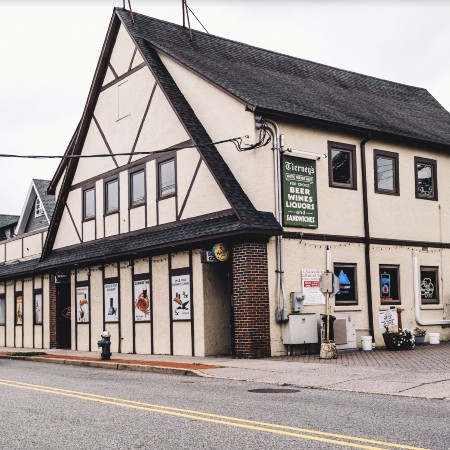
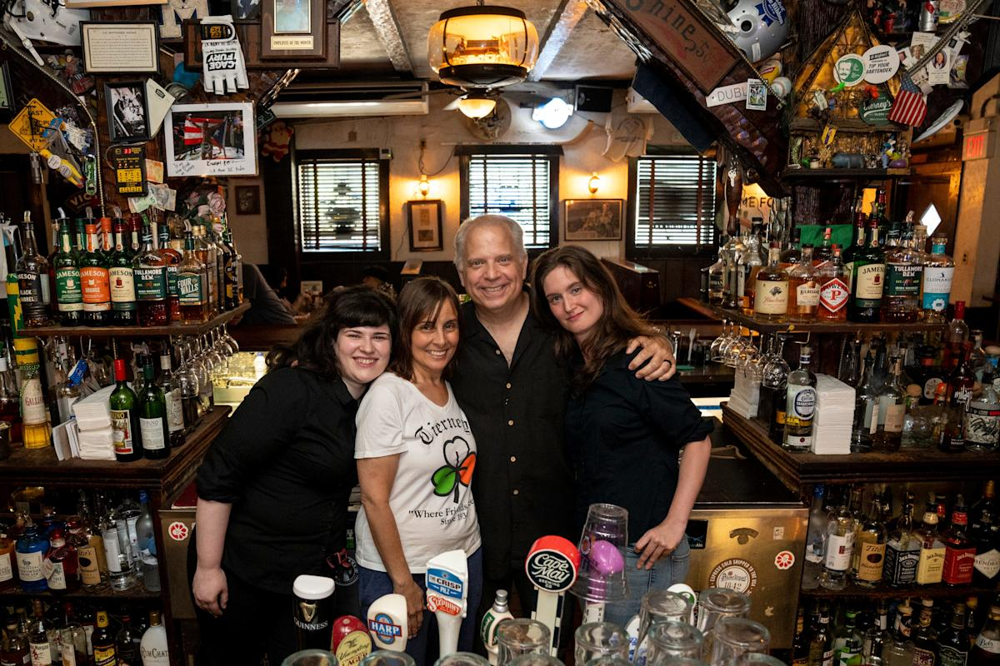
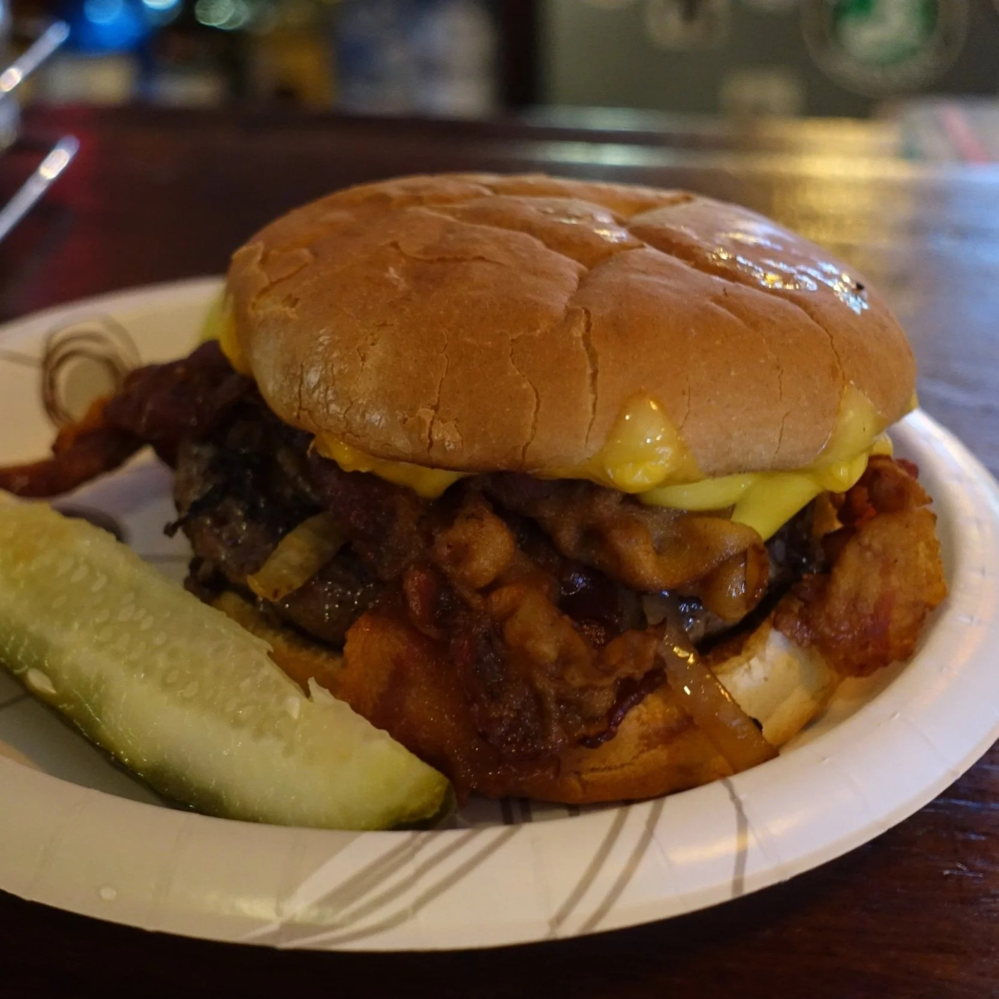
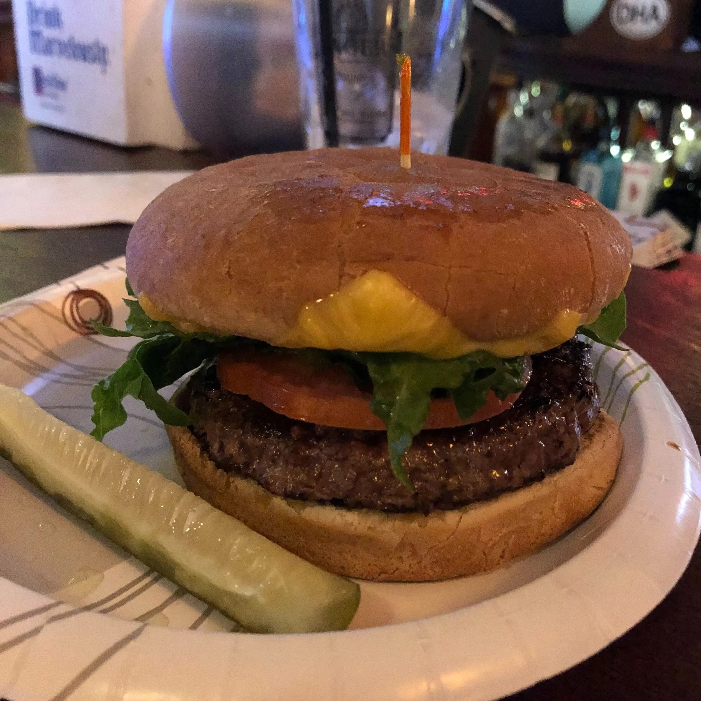
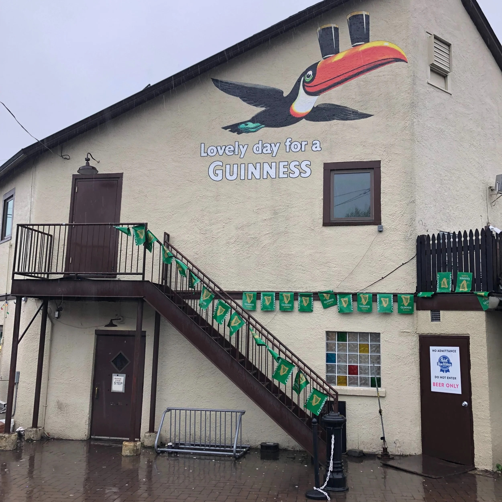
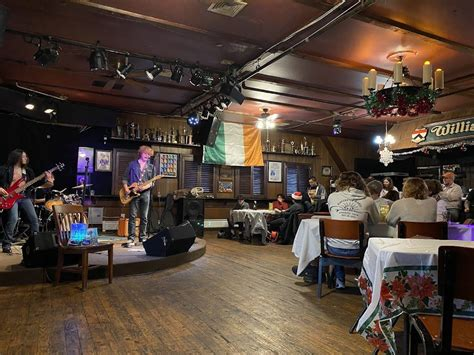
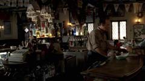

# Tierney's Tavern — Futuristic Website Creative Direction

**Project:** Tierney's Tavern website redesign  
**Venue:** 134–138 Valley Road, Montclair, New Jersey 07042, United States  
**Public-facing address:** 138 Valley Road, Montclair, NJ 07042  
**Coordinates:** `40.822509225043, -74.219748973846`  
**Research and event snapshot:** September 1, 2026  
**Creative platform:** `TIERNEY'S // 1934 → ∞`  
**Positioning line:** **A neighborhood institution, rendered in real time.**

> This is a production-oriented design specification. It uses real venue data, real source imagery, real coordinates, and verified event examples. It contains no lorem ipsum, fake addresses, generic stock-photo placeholders, fabricated menu prices, or invented testimonials.

---

## 1. Asset board

The repository includes the following real reference images:

| Preview | Subject | Intended design use |
|---|---|---|
|  | Tudor-style Valley Road exterior | Hero model reference, façade scan, Visit page |
|  | Tierney family inside the bar | Family story, press, About section |
|  | Off-menu Buddy Burger | Signature-food feature and Three.js scan |
|  | Tavern cheeseburger | Menu imagery |
|  | Exterior Guinness mural and stairs | Architecture, texture, upstairs access context |
|  | Upstairs stage and audience layout | Event-room configurator reference |
|  | Screen-location reference | Film and television archive |
|  | Current site mark | Brand-continuity reference |

The assets are collected as **research and design references**. Publication rights must be confirmed before any third-party photograph is shipped in the public website. The exact source, publisher, direct file URL, and proposed usage are recorded in [`ASSET_MANIFEST.md`](ASSET_MANIFEST.md).

---

## 2. Verified venue data

### Identity

- **Name:** Tierney's Tavern
- **Tagline:** “Where friends meet”
- **Founded:** 1934
- **Family connection to the property:** since the 1890s
- **Ownership story:** family owned and operated; the fifth generation is involved
- **Venue format:** ground-floor tavern and grill, upstairs bar/event room
- **Telephone:** `(862) 596-5986`
- **Official current website:** `https://www.tierneystavern1934.com/`
- **Legacy website and music archive:** `https://www.tierneystavern.com/`
- **Instagram:** `https://www.instagram.com/tierneystavern/`

### Public operating information

| Service | Hours |
|---|---|
| Bar, Monday–Saturday | 11:00 AM–1:00 AM |
| Bar, Sunday | 12:30 PM–12:00 AM |
| Kitchen, Monday–Saturday | 11:00 AM–11:00 PM |
| Kitchen, Sunday | 12:30 PM–10:00 PM |
| Closed | Easter Sunday and Christmas Day |

The updated official FAQ currently contains a Sunday AM/PM punctuation error. The design must therefore read all hours from one owner-controlled data record and allow temporary exceptions with start and expiration dates.

### Visit policies and amenities

- First-come, first-served seating; no current table reservations.
- To-go orders depend on kitchen capacity and are not accepted by telephone, app, or third-party delivery platform.
- Ten television screens in the main bar.
- Large customer parking lot.
- Cash, card, and Apple Pay accepted; ATM inside.
- Designated accessible parking and two sidewalk-accessible ground-floor entrances.
- No elevator to the upstairs room.
- Shared flat top and two shared fryers.
- The kitchen states that it cannot guarantee food is free of allergens already present on the menu.
- The kitchen cooks with lard.

### Upstairs room

- Current rental fee: **$60 per hour**
- Minimum rental: **2 hours**
- Bartender: included in the rental fee
- Gratuity: not included
- Current seating: approximately **55–60**
- Maximum seated capacity with additional furniture: **100**
- Standing-room-only capacity with tables and chairs removed: **135**
- Events hosted: bands, weddings, birthdays, comedy, plays, and private functions
- Catering: recommended because there is no second kitchen upstairs
- Event contact: Grace Tierney at `(862) 596-5986`

### Real event examples for the interaction prototype

These are not fictional card labels. They were publicly listed for the venue as of September 1, 2026:

| Date | Event | Time | Use in prototype |
|---|---|---:|---|
| September 3, 2026 | Lev Fer — Collective Comedy at Tierney's Tavern | 8:30 PM–10:00 PM | “Next signal” hero and ticket transition |
| September 19, 2026 | The BARD Band | 8:00 PM | Live-music event card and upstairs lighting state |
| October 11, 2026 | The Challenged | Published as an upcoming show | Future-events rail |

Production event data must come from Tierney's owner-managed calendar rather than remaining embedded in frontend code.

---

## 3. Original map location

### Canonical point

```text
Tierney's Tavern
138 Valley Road
Montclair, New Jersey 07042
United States

Latitude:  40.822509225043
Longitude: -74.219748973846
```

The coordinates come from the Google Maps point linked by the independent Sopranos location guide and align with other venue-location datasets.

### Map links

- **Google Maps place search:**  
  `https://www.google.com/maps/search/?api=1&query=Tierney%27s%20Tavern%2C%20138%20Valley%20Road%2C%20Montclair%2C%20NJ%2007042`
- **Google Maps exact point:**  
  `https://www.google.com/maps/search/?api=1&query=40.822509225043%2C-74.219748973846`
- **Apple Maps:**  
  `https://maps.apple.com/?ll=40.822509225043%2C-74.219748973846&q=Tierney%27s%20Tavern`
- **OpenStreetMap:**  
  `https://www.openstreetmap.org/?mlat=40.822509225043&mlon=-74.219748973846#map=19/40.822509225043/-74.219748973846`
- **Geo URI:**  
  `geo:40.822509225043,-74.219748973846?q=Tierney%27s%20Tavern`

### Keyless website embed

```html
<iframe
  title="Tierney's Tavern at 138 Valley Road, Montclair, New Jersey"
  src="https://www.google.com/maps?q=40.822509225043,-74.219748973846&z=18&output=embed"
  width="100%"
  height="540"
  loading="lazy"
  referrerpolicy="no-referrer-when-downgrade"
  style="border:0"
  allowfullscreen
></iframe>
```

The production implementation should initially display a lightweight local map card and load the third-party iframe only after the visitor selects **Explore the map**. This preserves performance and avoids contacting Google before the map is requested.

The machine-readable location files are:

- [`location/tierneys-tavern.json`](location/tierneys-tavern.json)
- [`location/tierneys-tavern.geojson`](location/tierneys-tavern.geojson)
- [`location/tierneys-map.html`](location/tierneys-map.html)
- [`assets/location/tierneys-directions-qr.svg`](assets/location/tierneys-directions-qr.svg)

---

## 4. Creative concept

# `TIERNEY'S // 1934 → ∞`

Tierney's should appear as a historic neighborhood tavern discovered inside a city from the near future. The website must not turn the business into a synthetic cyberpunk nightclub. Its future-facing expression comes from precision, spatial storytelling, responsive data, and light—not from erasing the tavern's wood, age, humor, or community character.

### Central narrative

```text
A FAMILY ARRIVED HERE IN THE 1890s.
THE TAVERN OPENED IN 1934.
THE SIGNAL NEVER STOPPED.
```

### Brand promise

**Old soul. Live signal. No expiration date.**

### Interface voice

- Direct, warm, locally grounded
- Confident without luxury-brand posturing
- Technical labels used as a visual layer, not as jargon-heavy body copy
- Short operational messages
- Real dates, times, policies, and accessibility details

### Visual tension

| Heritage layer | Future layer |
|---|---|
| Dark timber and plaster | Wireframes and architectural scan lines |
| Aged brass | Signal-green status lights |
| Archival photographs | Spatial depth and data labels |
| Warm bar lighting | Controlled shader dissolves |
| Hand-painted signs | Geometric mono typography |
| Family history | Live operational data |
| Community events | Digital ticket transitions |

---

## 5. Visual system

### Color tokens

| Token | Value | Use |
|---|---:|---|
| Midnight Wood | `#070908` | Primary canvas and navigation |
| Tavern Green | `#0D5134` | Brand foundation |
| Signal Green | `#62FF9D` | Live status and focused interaction |
| Beer Amber | `#FFB13B` | Food, bar light, and warmth |
| Aged Brass | `#B68A4A` | Historical rules and accents |
| Paper Bone | `#F0EBDD` | Main text and light surfaces |
| Service Red | `#FF4C3E` | Closures and urgent service changes |
| Smoke | `#A6AEA9` | Secondary text |
| Deep Glass | `rgba(7, 9, 8, 0.74)` | Layered panels |

Neon colors are limited to small signals, active controls, and shader highlights. Large surfaces remain dark, tactile, and warm.

### Typography

- **Display:** Unbounded
- **Interface and body:** Space Grotesk
- **Status, dates, coordinates, and metadata:** IBM Plex Mono

All three are available through open font licenses and can be self-hosted for stable rendering and privacy.

### Logo system

The continuity mark remains recognizably Tierney's. The digital identifier is:

```text
TT//1934
```

Its geometry derives from the tavern's steep roofline and half-timber façade. It has four restrained states:

- Idle
- Open
- Live upstairs
- After hours

The animated state is a single low-frequency signal pulse or brief light flicker, never continuous flashing.

---

## 6. Information architecture

### Primary navigation

1. **Tonight**
2. **Menu**
3. **Upstairs**
4. **Our Story**
5. **Visit**
6. **Shop**

Desktop adds a persistent **OPEN / CLOSED** status. Mobile uses a four-action bottom dock:

```text
TONIGHT     MENU     DIRECTIONS     CALL
```

The website must not display **Reserve a table** or **Order online**, because those actions are not currently offered.

### Page map

```text
/
├── /tonight
│   └── /events/<event-slug>
├── /menu
├── /upstairs
│   └── /upstairs/inquiry
├── /story
│   ├── /story/archive
│   └── /story/on-screen
├── /visit
├── /shop
└── /privacy
```

---

## 7. Homepage content and experience

### Opening view

**Eyebrow**

```text
MONTCLAIR, NEW JERSEY // TRANSMITTING SINCE 1934
```

**Headline**

# WHERE FRIENDS MEET.

**Support copy**

Five generations. One small grill. One legendary neighborhood signal.

**Primary action:** See what is on tonight  
**Secondary action:** Get directions  
**Utility action:** Call `(862) 596-5986`

### Real-time status rail

```text
BAR          OPEN UNTIL 1:00 AM
KITCHEN      SERVING UNTIL 11:00 PM
UPSTAIRS     NEXT: LEV FER / SEP 03 / 8:30 PM
PARKING      ON SITE
```

Each value comes from server-rendered venue data. Temporary messages have an `effective_from` and `expires_at` value so stale notices remove themselves.

### Homepage sequence

1. Three.js building scan
2. Live status rail
3. Next event
4. Buddy Burger feature
5. Family timeline
6. Upstairs venue configurator
7. On-screen archive
8. Visit and directions
9. Merchandise strip
10. Footer with full contact and hours

---

## 8. Three.js flagship scene — the building scan

### Purpose

Create a recognizable digital twin of the Tudor-style exterior and use the building itself as navigation into the tavern's story.

### Asset production

The exterior model should be produced from:

- High-resolution front, corner, side, rear, roofline, window, sign, and door photographs
- Measured or estimated façade proportions
- PBR materials derived from plaster, timber, brick, roof shingle, painted metal, glass, and signage
- Separate semantic meshes for ground floor, upstairs, roof, windows, signs, doors, and exterior stairs

### Opening timeline

| Time | Action |
|---:|---|
| 0.0–0.4 s | Signal-green scanner crosses the canvas |
| 0.4–1.2 s | Point cloud and roofline wireframe resolve |
| 1.2–2.0 s | Dissolve shader reveals plaster, timber, brick, and signage |
| 2.0–2.5 s | Ground-floor windows warm to beer amber |
| After 2.5 s | Scene enters a quiet idle state |

### Scroll chapters

#### Chapter 1 — Exterior

The visitor sees the full building and the **Where Friends Meet** message.

#### Chapter 2 — Architectural scan

The façade becomes partly transparent. Real DOM labels align with the 3D object:

```text
LEVEL 01 // BAR + GRILL
LEVEL 02 // LIVE ROOM
SIGNAL ORIGIN // 1934
```

#### Chapter 3 — Exploded floor view

The roof lifts and the second floor separates slightly from the first. The downstairs glows amber; the upstairs glows green. The next real event ticket appears adjacent to level two.

#### Chapter 4 — Entry transition

The camera advances toward the door, then the scene dissolves into the server-rendered **Tonight** section. A still image and immediate content remain available before WebGL loads.

### Operational states

| State | Three.js response |
|---|---|
| Open | Warm ground-floor windows, green entrance signal |
| Closed | Dim windows, muted signal, next-opening text |
| Public event upstairs | Slow upstairs light pulse and minimal waveform |
| Private event upstairs | Neutral white-violet upper-floor state; no public event title |
| Reduced motion | Finished building shown immediately; no camera travel or particles |
| WebGL unavailable | Exterior photograph and complete HTML content |

### Performance targets

- Desktop GLB: 1.5–2.5 MB
- Mobile GLB: 700 KB–1.2 MB
- Desktop geometry: 70,000–120,000 triangles
- Mobile geometry: 25,000–50,000 triangles
- Desktop textures: maximum 2K
- Mobile textures: maximum 1K
- Pixel ratio cap: 1.75 desktop, 1.5 mobile
- Render loop pauses off-screen and in hidden tabs
- Hero poster stays visible until the first successful WebGL frame

---

## 9. Signature Three.js food scene

### Subject

The real Buddy Burger: beef, American cheese, bacon, and fried onions on a soft bun, with the exact final build confirmed by the tavern before photography or modeling.

### Interaction

- Constrained drag rotates the burger by no more than 30 degrees.
- Selecting **Scan the Buddy Burger** separates the layers vertically.
- A thermal-style shader passes once through the stack.
- Real DOM labels identify the ingredients.
- The burger recombines and the **Explore the grill** action appears.
- Mobile plays the separation once on entry, with a replay control.
- Reduced-motion mode displays one finished food image with ingredient text.

This scene is loaded only when its section approaches the viewport.

---

## 10. Upstairs room configurator

### Camera and style

A simplified isometric room model uses an orthographic camera. It is a planning tool rather than an exact architectural survey.

### Configurations

- Live band
- Comedy
- Birthday
- Wedding
- Cocktail event
- Seated dinner

Selecting a format rearranges instanced furniture, stage elements, aisles, and standing zones.

### Capacity rules

The interface uses the venue's published capacities:

```text
CURRENT SEATING      55–60
ADDITIONAL SEATING   UP TO 100
STANDING ONLY        UP TO 135
```

Warnings are factual and layout-specific. The tool never presents an automatically generated arrangement as an approved fire-code plan. The inquiry summary states that the final layout is confirmed by Tierney's.

### Rental estimate

A four-hour selection displays:

```text
ROOM RENTAL          $240
BARTENDER            INCLUDED
GRATUITY             NOT INCLUDED
FINAL ARRANGEMENT    CONFIRMED BY TIERNEY'S
```

The rate is managed in the admin interface so the website does not require a code deployment when pricing changes.

### Inquiry fields

- Name
- Telephone
- Email
- Event type
- Preferred date
- Alternate date
- Approximate guest count
- Start and end time
- Live-performance requirements
- Bar arrangement
- Catering plan
- Accessibility requirements
- Additional notes

The telephone option remains prominent for Grace Tierney at `(862) 596-5986`.

---

## 11. Tonight and event-detail design

The default view begins with **Tonight**, not a generic calendar grid.

```text
NOW
NEXT
THIS WEEKEND
LATER THIS MONTH
```

### Event card contents

- Event title
- Calendar date
- Start and end time when published
- Upstairs or downstairs
- Event category
- Cover charge when published
- Age policy when published
- Real poster or artist image
- Add to calendar
- Share
- Directions
- Accessibility note

### Real prototype ticket

```text
LIVE SIGNAL // 003
THURSDAY / SEPTEMBER 03 / 2026
LEV FER
COLLECTIVE COMEDY AT TIERNEY'S TAVERN
8:30 PM–10:00 PM
LEVEL 02
```

The event poster expands from the card into the detail route using the View Transition API when supported. HTMX falls back to a normal swap.

Past events enter a searchable archive instead of disappearing. The archive becomes evidence of Tierney's local music, comedy, and community history.

---

## 12. Menu design

### Categories

- Signature
- Burgers
- From the grill
- Sandwiches
- Sides
- Drinks

### Publicly listed food

**From the grill**

- Burgers
- Cheeseburgers
- Grilled chicken
- Pastrami
- Corned beef
- Cheesesteak
- Grilled cheese
- Wings
- Chicken fingers
- Hot dog
- Taylor ham

**Sandwiches**

- Chicken salad
- Tuna salad
- Turkey
- Turkey club
- BLT
- Roast beef
- Roast beef club
- Ham
- Liverwurst

**Sides**

- Fries
- Cheese fries
- Chili fries
- Chili-and-cheese fries
- Onion rings
- Pickles
- Macaroni salad
- Potato salad
- Coleslaw
- Chili cup or bowl

No prices are invented in this document because the current official public pages do not provide an authoritative price list. The production menu must use a dated, owner-approved price record.

### Safety notice

The menu displays this message before the item list and near any food inquiry control:

> **Kitchen protocol:** Tierney's uses a shared flat top and shared fryers, cannot guarantee freedom from allergens already present on the menu, and cooks with lard. Guests should speak directly with staff about allergies and dietary requirements.

The menu ends with **Visit the grill**, **Get directions**, and **Call**, not an online checkout.

---

## 13. Family history and on-screen archive

### Timeline copy

```text
1890s
THE TIERNEY FAMILY MAKES THE PROPERTY HOME.

1934
TIERNEY'S TAVERN OPENS AFTER PROHIBITION.

2007
THE TAVERN APPEARS IN THE SOPRANOS, SEASON 6, EPISODE 13.

2024
TIERNEY'S IS NAMED TO USA TODAY'S BARS OF THE YEAR.

GENERATION V
THE NEXT GENERATION CARRIES THE TAVERN FORWARD.

∞
STILL TRANSMITTING.
```

The timeline uses authentic photographs, scans, menus, signs, press clippings, and family stories. The WebGL background provides depth, but all text and images remain accessible HTML.

### Film-location mode

```text
LOCATION ID       TT-1934
STRUCTURE         HISTORIC TUDOR-STYLE TAVERN
INTERIOR          WOOD BAR / GRILL / UPSTAIRS STAGE
LEVELS            02
PRODUCTION STATUS INQUIRIES OPEN
CONTACT            (862) 596-5986
```

The public page can include exterior and interior reference photographs, approximate measurements, load-in route, parking notes, sound notes, and a downloadable location deck once those operational details are owner-approved.

---

## 14. Visit page

### Primary block

```text
TIERNEY'S TAVERN
138 VALLEY ROAD
MONTCLAIR, NEW JERSEY 07042

40.822509225043, -74.219748973846

(862) 596-5986
```

### Actions

- Get directions
- Call the tavern
- Copy address
- Copy coordinates
- Explore the map
- View tonight

### Visit cards

- Today's bar hours
- Today's kitchen hours
- Parking on site
- Ten screens in the main bar
- First-come seating
- Accessible ground-floor entrances
- No elevator to upstairs
- Cash, cards, and Apple Pay
- ATM inside

The map loads only on request. The surrounding HTML contains the full address and directions actions even when third-party maps are blocked.

---

## 15. Merchandise

The current public offer includes gift cards, T-shirts, buttons, towels, and other rotating items sold through the bartenders.

### Release sequence

**Phase one**

- Real photographed catalog
- Sizes and availability
- In-tavern purchase instructions
- Gift-card instructions

**Phase two**

- Small online drops
- Inventory-aware checkout
- Local pickup and shipping rules

Potential product naming:

```text
TT//1934 BLACK TEE
WHERE FRIENDS MEET CAP
90 YEARS ARCHIVE EDITION
VALLEY ROAD SIGNAL PATCH
```

These are proposed product names, not claims that the products already exist.

---

## 16. Motion system

| Level | Technology | Use |
|---|---|---|
| Spatial | Three.js | Building, Buddy Burger, room configurator |
| Narrative | GSAP ScrollTrigger | Camera chapters, history, section sequencing |
| State | View Transitions and Web Animations API | Event detail, filters, panels |
| Micro | CSS and SVG | Buttons, lines, indicators, map route, image reveals |

### Motion rules

- No autoplay audio
- No scroll hijacking
- No custom cursor
- No continuous type scrambling
- No persistent flashing
- No animation that delays hours, directions, menu, or telephone access
- `prefers-reduced-motion` respected across all layers
- Transform and opacity prioritized for DOM animation
- WebGL loops stop when scenes are not visible

---

## 17. Mobile experience

The mobile design is the primary in-transit use case.

```text
TT//1934                                     ● OPEN

WHERE FRIENDS MEET.

NEXT UPSTAIRS
LEV FER / SEPTEMBER 03 / 8:30 PM

BAR          OPEN
KITCHEN      OPEN
PARKING      ON SITE

[DIRECTIONS]        [CALL]

────────────────────────────────────────────
TONIGHT        MENU        DIRECTIONS        CALL
```

- Minimum 48-pixel interactive targets
- Base body text of at least 18 pixels
- Building scene becomes a reduced model or still on constrained devices
- Status, directions, and telephone remain visible before the first scroll
- No interaction depends on hover

---

## 18. Technical implementation

### Recommended stack

- Flask
- Jinja
- HTMX
- Alpine.js
- Tailwind CSS with custom tokens
- Three.js
- GSAP and ScrollTrigger
- PostgreSQL in production; SQLite for local development
- GLTF/GLB with Draco or Meshopt compression
- KTX2/Basis compressed textures
- WebP and AVIF responsive photography

### Progressive enhancement

The first response contains:

- Headline and brand copy
- Open/closed status
- Next event
- Bar and kitchen hours
- Address, directions, and telephone
- Menu categories and safety notice

Three.js, GSAP, event transitions, and map embeds enhance that complete document rather than replacing it.

### Suggested module layout

```text
static/
├── js/
│   ├── app.js
│   ├── motion/
│   │   ├── motion-preferences.js
│   │   ├── scroll-timelines.js
│   │   └── view-transitions.js
│   └── three/
│       ├── scene-controller.js
│       ├── hero-scene.js
│       ├── burger-scene.js
│       ├── room-scene.js
│       ├── loaders.js
│       ├── quality-profile.js
│       ├── materials/
│       │   ├── dissolve-material.js
│       │   └── signal-material.js
│       └── shaders/
│           ├── dissolve.vert
│           └── dissolve.frag
├── models/
│   ├── tavern-desktop.glb
│   ├── tavern-mobile.glb
│   ├── buddy-burger.glb
│   └── upstairs-room.glb
└── images/
    ├── hero/
    ├── menu/
    ├── events/
    ├── archive/
    └── merch/
```

This is a target production structure; the collected research assets remain under `assets/reference/` and must not be confused with optimized public-site files.

---

## 19. Data models

### Venue status

```json
{
  "bar_status": "open",
  "kitchen_status": "open",
  "upstairs_status": "public_event",
  "message": "Collective Comedy upstairs Thursday at 8:30 PM",
  "effective_from": "2026-09-01T00:00:00-04:00",
  "expires_at": "2026-09-04T02:00:00-04:00"
}
```

### Event

```json
{
  "title": "Lev Fer — Collective Comedy at Tierney's Tavern",
  "slug": "lev-fer-collective-comedy-2026-09-03",
  "event_type": "comedy",
  "start_datetime": "2026-09-03T20:30:00-04:00",
  "end_datetime": "2026-09-03T22:00:00-04:00",
  "room": "upstairs",
  "venue_address": "138 Valley Road, Montclair, NJ 07042",
  "published": true,
  "featured": true
}
```

### Location

```json
{
  "name": "Tierney's Tavern",
  "street_address": "138 Valley Road",
  "locality": "Montclair",
  "region": "NJ",
  "postal_code": "07042",
  "country": "US",
  "latitude": 40.822509225043,
  "longitude": -74.219748973846,
  "telephone": "+1-862-596-5986"
}
```

### Event inquiry

```text
contact_name
telephone
email
event_type
preferred_date
alternate_date
guest_count
start_time
end_time
bar_arrangement
catering_plan
performance_requirements
accessibility_requirements
notes
status
created_at
```

---

## 20. Structured data baseline

```html
<script type="application/ld+json">
{
  "@context": "https://schema.org",
  "@type": "BarOrPub",
  "name": "Tierney's Tavern",
  "slogan": "Where friends meet",
  "foundingDate": "1934",
  "telephone": "+1-862-596-5986",
  "url": "https://www.tierneystavern1934.com/",
  "address": {
    "@type": "PostalAddress",
    "streetAddress": "138 Valley Road",
    "addressLocality": "Montclair",
    "addressRegion": "NJ",
    "postalCode": "07042",
    "addressCountry": "US"
  },
  "geo": {
    "@type": "GeoCoordinates",
    "latitude": 40.822509225043,
    "longitude": -74.219748973846
  },
  "servesCuisine": ["American", "Bar food"],
  "sameAs": [
    "https://www.instagram.com/tierneystavern/",
    "https://www.facebook.com/p/Tierneys-Tavern-100057451689729/"
  ]
}
</script>
```

Opening-hours structured data should be generated from the same owner-controlled record as the visible hours. It is deliberately not duplicated as hand-maintained JSON-LD in this specification.

---

## 21. Performance and accessibility acceptance criteria

### Performance

- Useful HTML visible before Three.js initialization
- Largest Contentful Paint target below 2.5 seconds on a representative mid-range mobile device and 4G profile
- Initial compressed JavaScript target below 200 KB before optional Three.js and GSAP chunks
- 3D packages loaded after essential content
- No more than two font-family downloads in the initial route
- Responsive AVIF/WebP with explicit dimensions
- Offscreen scenes suspended
- Adaptive render quality after initial frame-time sampling
- No autoplay video on data-saving connections

### Accessibility

- WCAG 2.2 AA contrast targets
- Complete keyboard navigation
- Visible focus states
- Semantic heading order
- Skip link
- Touch targets at least 48 by 48 pixels
- Canvas marked decorative where equivalent DOM content exists
- All operational data available outside WebGL
- Reduced-motion mode
- Form errors associated with fields
- Event posters receive meaningful alternate text
- Upstairs accessibility limitation stated before inquiry submission

---

## 22. Six-week production sequence

### Week 1 — Operational source of truth

- Owner review of hours, contact routing, kitchen notice, event policy, upstairs rates, capacity, accessibility language, and address display
- Export current event calendar
- Obtain a current priced menu
- Confirm publication rights for all photographs
- Photograph missing angles needed for 3D reconstruction

### Week 2 — UX and visual system

- Final site map
- Mobile-first wireframes
- Design tokens
- Typography and logo system
- Homepage and Tonight interaction prototype
- Low-fidelity building blockout

### Week 3 — High-fidelity and 3D prototype

- Exterior model and materials
- Hero shader
- Scroll choreography
- Event-card transition
- Upstairs configurator proof
- Reduced-motion state

### Week 4 — Application development

- Flask/Jinja routes
- HTMX event and menu filters
- Alpine components
- Admin data records
- Contact and event inquiry flows
- Central venue-status service

### Week 5 — Content and optimization

- Photography processing
- Archive capture
- Menu entry
- Event data
- Model compression
- Image optimization
- Schema and social cards

### Week 6 — Validation and launch

- Device and browser matrix
- Keyboard and screen-reader review
- Reduced-motion and low-power tests
- Core Web Vitals test
- Form delivery and spam protection
- Structured-data validation
- Owner training
- Launch and monitoring

---

## 23. Success measures

- Directions selections
- Telephone selections
- Tonight-page engagement
- Add-to-calendar actions
- Upstairs inquiry starts and completions
- Menu views
- Event archive visits
- Film-location inquiries
- Merchandise interest
- Percentage of visitors who find current hours without opening a second route
- Staff time needed to publish an event or temporary closure
- Three.js fallback rate and adaptive-quality distribution

---

## 24. Source register

### Official Tierney's sources

- Current website: `https://www.tierneystavern1934.com/`
- About: `https://www.tierneystavern1934.com/about`
- FAQ: `https://www.tierneystavern1934.com/f-a-q`
- Upstairs: `https://www.tierneystavern1934.com/upstairs`
- Kitchen: `https://www.tierneystavern1934.com/kitchen`
- Filming: `https://www.tierneystavern1934.com/filming`
- Merchandise: `https://www.tierneystavern1934.com/merch`
- Legacy site: `https://www.tierneystavern.com/`
- Legacy gallery: `https://www.tierneystavern.com/gallery.php`
- Instagram: `https://www.instagram.com/tierneystavern/`

### Independent sources

- NorthJersey/AOL profile and family photograph:  
  `https://www.aol.com/tierneys-tavern-one-best-bars-090654255.html`
- Montclair Girl exterior photograph and location feature:  
  `https://www.themontclairgirl.com/sopranos-landmarks-north-jersey/`
- Mike Eats NYC Burgers review and food images:  
  `https://www.mikeeatsnycburgers.com/reviews/tierneys-tavern`
- Sopranos location and exact map point:  
  `https://www.sopranos-locations.com/locations/bar-near-canada/`
- Lev Fer event listing:  
  `https://www.eventbrite.com/e/lev-fer-collective-comedy-at-tierneys-tavern-tickets-1998112299676`
- The BARD Band event listing:  
  `https://www.shazam.com/event/c5fbdd1f-d804-4038-8491-e405fe7a5956`
- The Challenged listing:  
  `https://www.songkick.com/venues/564501-tierneys-tavern`

---

# Final experiential statement

```text
TIERNEY'S // 1934 → ∞

A FAMILY LANDMARK.
A LIVE ROOM.
A SMALL GRILL WITH A BIG SIGNAL.
A NEIGHBORHOOD INSTITUTION RENDERED IN REAL TIME.

STATUS: STILL HERE.
```
